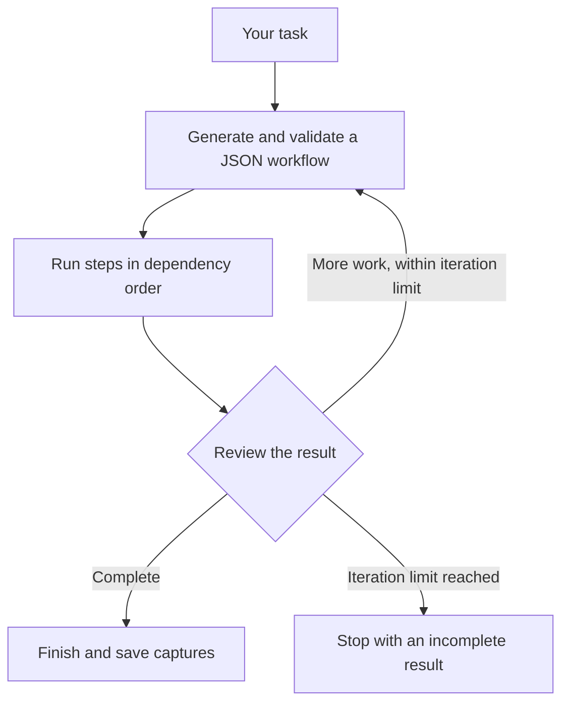

# Codex Autopilot

[](https://github.com/gaslit-ai/codex-autopilot/actions/workflows/verify.yml)
[](https://github.com/gaslit-ai/codex-autopilot/releases/latest)

Turn a task into a validated workflow, run its steps through Codex, and review the result until complete or the iteration limit is reached. Inspect prompts, events, outputs, and the execution graph in a local viewer.

Built for bounded repository tasks: investigating defects, implementing changes, and checking results. Uses your own Codex account and has no runtime npm dependencies.

## Install

Requires **Node.js 24 or newer**, Git, and an authenticated [Codex CLI](https://learn.chatgpt.com/docs/codex-cli). Runs on macOS, Linux, and Windows (including WSL).

```sh
npm install -g @openai/codex
codex login
npm install -g https://github.com/gaslit-ai/codex-autopilot/releases/download/v0.1.0/codex-autopilot-0.1.0.tgz
codex-autopilot --help
```

The [GitHub release](https://github.com/gaslit-ai/codex-autopilot/releases/latest) contains the installable package and its SHA-256 checksum. npm registry publication is pending; the command above installs the released package directly.

Run commands **inside the Git repository you want to work on**. Autopilot bundles its planning and review instructions; no project-specific setup or copied skill files are required.

## Run

Inspect a repository with the default read-only sandbox:

```sh
codex-autopilot "Review this repository and report the highest-impact improvements"
```

Allow repository edits:

```sh
codex-autopilot --sandbox workspace-write "Implement the requested change and verify it"
```

Autopilot inherits Codex's configured model and reasoning effort. Use `--model` and `--effort` to override them. `--concurrency` bounds simultaneous steps and `--max-iterations` bounds the review loop. All steps share the same checkout. `--search` enables live web search for execution steps.

Start the viewer from the same directory, then open [localhost:4141](http://127.0.0.1:4141):

```sh
codex-autopilot-viewer
```

For captures elsewhere, use `codex-autopilot-viewer --runs-dir /path/to/captures`.

Codex access and usage are governed by your own account. `CODEX_BIN` selects an executable and `CODEX_HOME` selects Codex configuration and sessions. These are local settings; Autopilot includes no credentials or accounts.

## How a workflow works

Start with a task in plain language. Autopilot generates a JSON workflow containing 1–8 agent steps and their dependencies; you do not need to write JSON. The CLI currently generates workflows internally and does not accept a workflow file.



Each plan is saved as `workflow-N.json` in the run directory. Successful step outputs become context for dependent steps; failed prerequisites prevent their dependents from running. See the [workflow JSON example and contract](https://github.com/gaslit-ai/codex-autopilot/blob/main/docs/autopilot/workflow-contract.md).

Completion is a model judgment. Check the reported evidence and actual changes before accepting the result. The [operator guide](https://github.com/gaslit-ai/codex-autopilot/blob/main/docs/autopilot/operating-autopilot.md) covers permissions, cancellation, troubleshooting, and exit codes.

## Captures and privacy

Runs are saved to `runs/autopilot/` beneath your working directory. Captures can include task text, source excerpts, paths, and command output. Keep them private and ignore `runs/` in your own repository. The viewer binds to loopback by default. Publishing this package does not upload your runs.

## Develop

```sh
git clone https://github.com/gaslit-ai/codex-autopilot.git
cd codex-autopilot
npm ci
npm run verify
npm run build
```

Source commands are `npm run autopilot -- "Your task"` and `npm run viewer`. Development runs TypeScript directly; npm ships compiled JavaScript, static viewer assets, and two bundled skills. There are no runtime npm dependencies or install scripts.

`npm run verify` checks types, syntax, behavioral tests, documentation links, and formatting. `npm run test:package` builds and tests the actual packed package in a separate temporary repository, without a Codex account or model call.

Read the [operator guide](https://github.com/gaslit-ai/codex-autopilot/blob/main/docs/autopilot/operating-autopilot.md), [workflow contract](https://github.com/gaslit-ai/codex-autopilot/blob/main/docs/autopilot/workflow-contract.md), [architecture](https://github.com/gaslit-ai/codex-autopilot/blob/main/docs/autopilot/architecture.md), and [capture reference](https://github.com/gaslit-ai/codex-autopilot/blob/main/docs/run-data-ui.md).

## Contribute

See [CONTRIBUTING.md](https://github.com/gaslit-ai/codex-autopilot/blob/main/CONTRIBUTING.md) for setup, design boundaries, and the pull request checks. Report reproducible bugs through [GitHub issues](https://github.com/gaslit-ai/codex-autopilot/issues). Report vulnerabilities privately using the [security policy](https://github.com/gaslit-ai/codex-autopilot/blob/main/SECURITY.md).

## License

MIT. See [LICENSE](https://github.com/gaslit-ai/codex-autopilot/blob/main/LICENSE).
