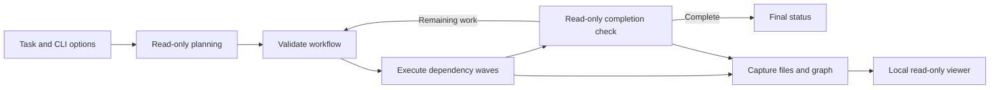

# Architecture

Autopilot is a local orchestrator around `codex exec`. Its end state is a bounded, inspectable run with a validated plan, captured process evidence, and an explicit outcome.

## Boundaries

| Module                                                   | Input → output                                          | Responsibility                                                           |
| -------------------------------------------------------- | ------------------------------------------------------- | ------------------------------------------------------------------------ |
| [options.ts](../../src/autopilot/options.ts)             | CLI arguments → validated options                       | Reject unknown flags, invalid bounds, unsupported permission values.     |
| [workflow.ts](../../src/autopilot/workflow.ts)           | JSON → workflow/completion; dependency results → prompt | Validate structure and DAG invariants, construct task context.           |
| [prompts.ts](../../src/autopilot/prompts.ts)             | Task, prior results, errors → planning prompt/schema    | Define model-facing planning and structured-output contracts.            |
| [autopilot.ts](../../src/autopilot.ts)                   | Options → run outcome                                   | Plan, schedule, review, iterate, cancel.                                 |
| [codex-process.ts](../../src/autopilot/codex-process.ts) | Prompt/settings → final message or captured failure     | Spawn argument arrays, stream stdin, parse JSONL, await process closure. |
| [artifacts.ts](../../src/autopilot/artifacts.ts)         | Exec results → manifest/graph                           | Atomically publish manifests and add supplemental collaboration edges.   |
| [transcripts.ts](../../src/transcripts.ts)               | Thread ID and Codex home → optional rollout path        | Search current and archived sessions without following entry symlinks.   |
| [viewer.ts](../../src/viewer.ts)                         | Local GET request → HTML, JSON, or text                 | Enforce host and real-file boundaries; serve the browser UI.             |

Runtime code uses Node.js built-ins, without an SDK, database, queue, web framework, or runtime npm dependency. Development runs TypeScript directly. The package build compiles it to JavaScript and copies the viewer assets; npm installations need no compiler or install script. Planning and review instructions are loaded from two bundled skills relative to the package, independently of the target repository.

## Verification

`npm run verify` is the local and CI gate. Tests exercise strict workflow validation, subprocess startup and event handling, failure propagation, captures, file boundaries, transcript matching, and shell quoting. The fake Codex process receives real stdin and emits JSONL, so process integration is tested without model calls.

The packed-package smoke test installs the release tarball into a temporary prefix, then exercises both CLI commands and a complete deterministic run from an unrelated repository. This catches missing files, TypeScript under `node_modules`, broken bin entry points, and accidental dependencies on this development checkout.

The viewer serves only local capture files and optional Codex transcripts. It is not an authentication service or a remote multi-user application. Model-mediated task completion and undocumented rollout enrichment remain separate from deterministic runner validation.
